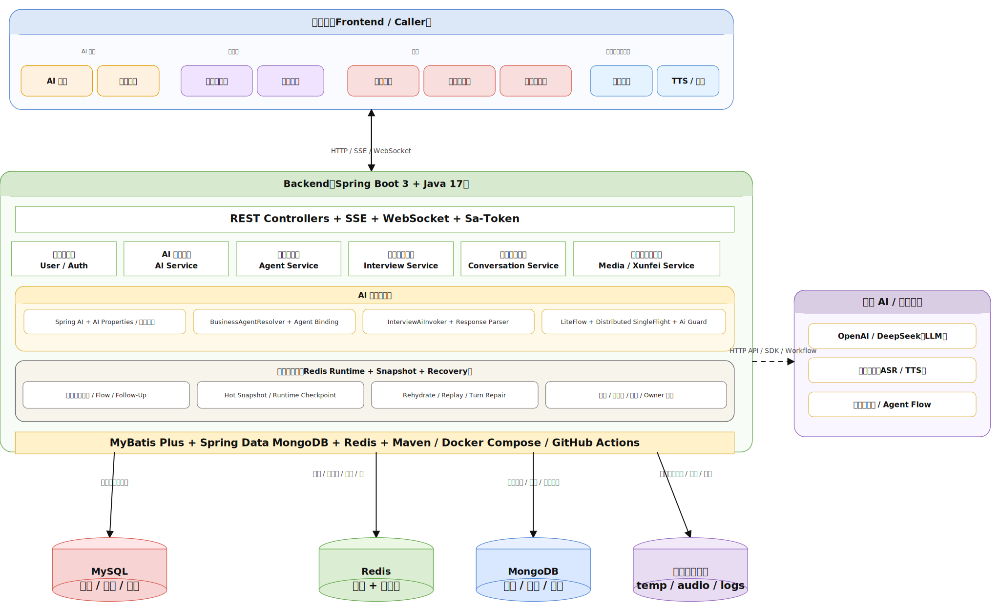
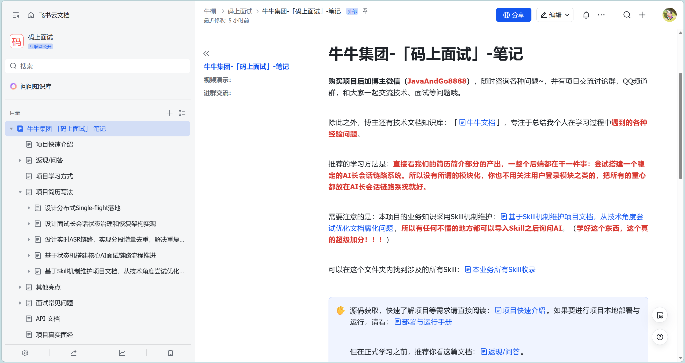
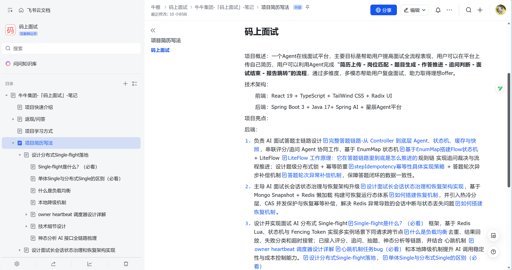
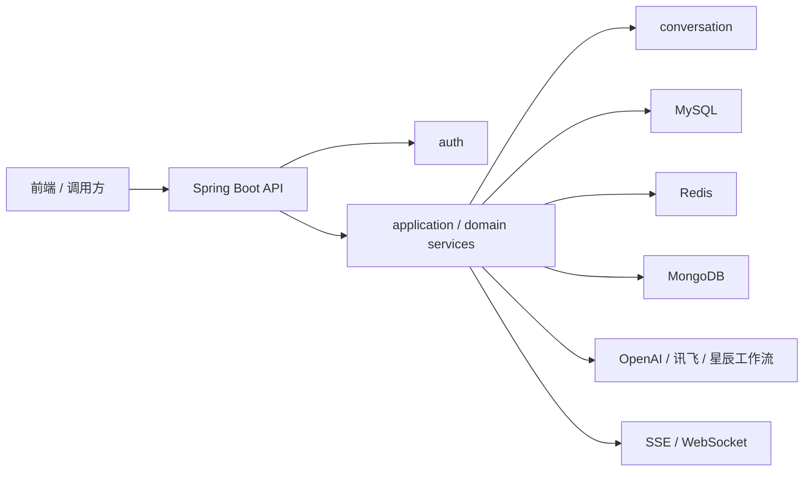

<div align="center">

**码上面试平台** - 基于大语言模型的简历分析、模拟面试服务
[](https://openjdk.org/)
[](https://spring.io/projects/spring-boot)
[](https://react.dev/)
[](https://www.typescriptlang.org/)
[](https://www.postgresql.org/)
</div>


这是一个基于 Spring Boot 3 + Java 17 + Spring AI + MySQL + MongoDB + Redis 构建的 AI 智能助手后端项目，聚焦 AI 对话、智能体会话、模拟面试、实时语音转写和长文本语音合成等场景。项目采用模块化单体架构，支持 HTTP、SSE、WebSocket 多链路交互，兼顾业务完整性、工程规范性和开箱即用性。

演示视频：[Bilibili 项目展示]( https://www.bilibili.com/video/BV1ccR9B9EEm/?share_source=copy_web&vd_source=2147a1677cc5a940112d07c6f03c4bc9)

## 系统架构：


## 简历写法

1. 负责 AI 面试答题主链路设计，串联评分/追问 Agent 协同工作，基于 EnumMap 状态机 + LiteFlow 规则链 实现追问裁决与流程推进；设计题级分布式锁 + 幂等防重 + 答题轮次异步补偿机制，保障答题闭环的数据一致性。
2. 主导 AI 面试长会话状态治理与恢复架构升级，基于 Mongo Snapshot + Redis 懒加载 构建可恢复运行态体系，并引入热冷分层、CAS 并发保护与恢复幂等补偿，解决 Redis 异常导致的会话中断与状态丢失问题。
3. 设计并实现面试 AI 分布式 Single-flight框架，基于 Redis Lua、状态机与 Fencing Token 实现多实例场景下同请求跨节点去重、结果回放、失败分类和超时接管；已接入评分、追问、抽题、神态分析等链路，并结合 心跳机制 和本地降级机制提升 AI 调用稳定性与成本控制能力。
4. 设计并优化基于 WebSocket + Xunfei AST 的实时 ASR 链路，实现分段增量去重，解决重复文本等问题，借鉴 NIO Buffer 的异步缓冲思想设计会话级 TranscriptionSessionContext，实现音频接收与下游推流解耦，并基于 TreeMap + seg_id/pgs/rg/bg/ed 完成分段增量去重与有序重建，解决重复文本、前缀误删和结果抖动问题
5. 设计并推动面向 AI Coding 的 Skill 业务知识体系，将分散、过时、不可持续维护的传统文档升级为可被 Code Agent 直接消费的模块化业务知识单元，解决复杂业务开发中的知识断层与隐性规则丢失问题。

## 在哪购买？

本项目承诺完整功能免费开源，也不会做所谓的 Pro 版或“付费解锁核心功能”之类的设计。

如果你想学习这个项目，或者希望把它作为个人项目经历 / 毕设选题，我也整理了一套相对细致的教程：从基础设施搭建、核心业务实现，到最后如何在面试中讲清楚思路与亮点，尽量把容易卡住的地方讲透。

如果你确实需要更系统的辅导，可以前往抖音/小红书搜索程序员牛肉，在我的店铺中购买对应飞书文档。

# 文档展示






## 架构简图



## 功能入口

- AI 对话：`/api/xunzhi/v1/ai/**`
- 智能体会话：`/api/xunzhi/v1/agents/**`
- 面试会话与记录：`/api/xunzhi/v1/interview/**`
- 长文本语音合成：`/api/xunzhi/v1/xunfei/tts/**`
- 实时语音转写：`/api/xunzhi/v1/xunfei/audio-to-text/{userId}`
- WebSocket 管理接口：`/api/xunzhi/v1/websocket/**`
- 题库采集与审核：`/api/xunzhi/v1/collection/**`
- 健康检查：`/actuator/health`

## 技术栈

- Java 17
- Spring Boot 3
- Spring AI
- MyBatis Plus
- MySQL
- MongoDB
- Redis
- Sa-Token
- WebSocket / SSE
- Maven / GitHub Actions / Docker Compose

## 测试与 CI

统一校验入口：

```bash
./mvnw -B -ntp clean verify
```

当前 CI 覆盖：

- Maven 构建与测试
- JDK 17 基线校验
- 仓库元数据与文档格式检查

工作流文件见 [`.github/workflows/backend-ci.yml`](.github/workflows/backend-ci.yml)。

## 开源协作

- 许可证：[MIT](LICENSE)
- 贡献指南：[CONTRIBUTING.md](CONTRIBUTING.md)
- 行为准则：[CODE_OF_CONDUCT.md](CODE_OF_CONDUCT.md)
- 安全说明：[SECURITY.md](SECURITY.md)

## 发布说明

当前仓库仍保留开发期配置结构，真实密钥脱敏和最终公开发布前的安全清理将在后续阶段单独处理。本仓库本轮重点是把架构边界、运行链路、文档门面和开源协作面收敛到展示级标准。
