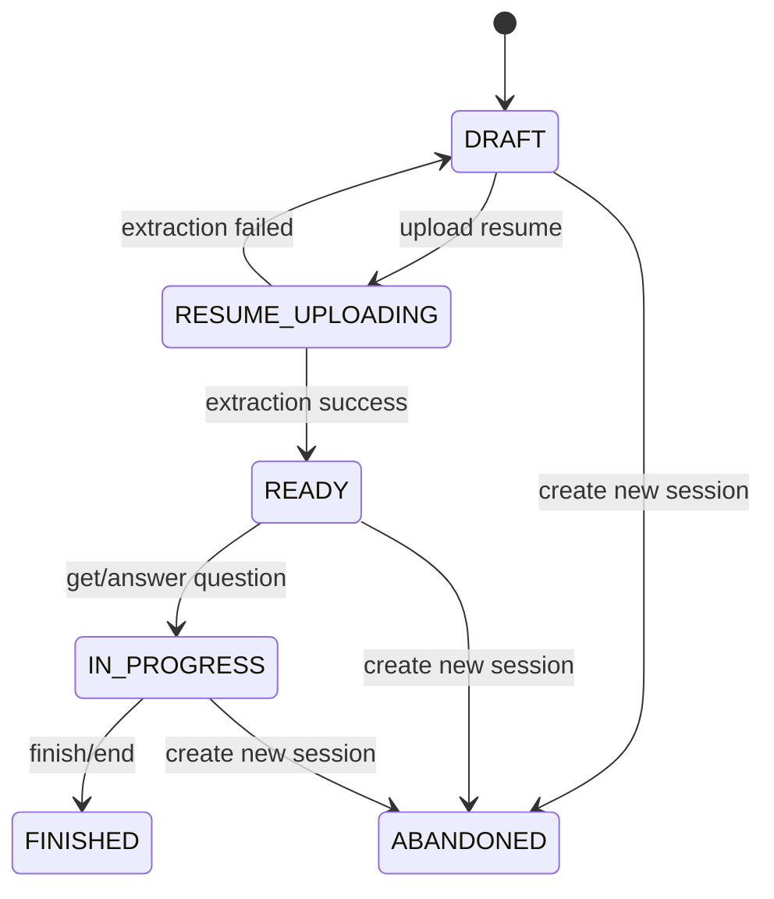
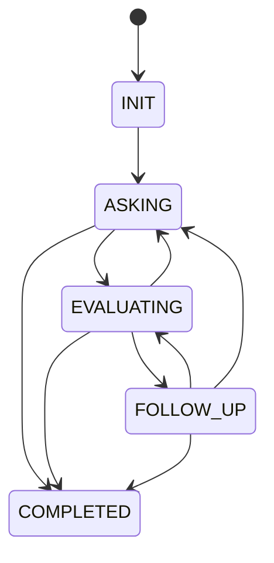
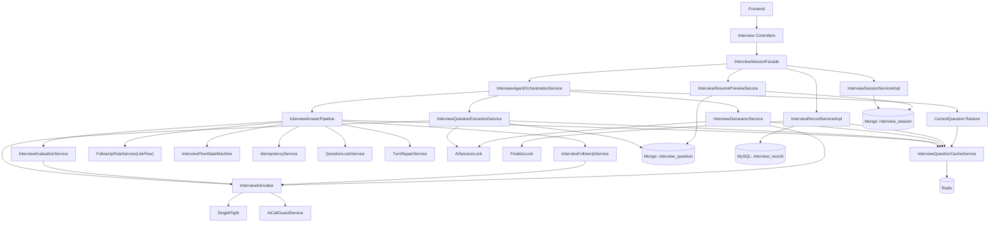

# 面试业务数据原型与流转架构（后端）

更新时间：2026-04-17

## 1. 目标与范围
- 目标：把面试业务的“数据长什么样、在哪里、怎么流动”一次讲清楚，作为后续开发与排障的统一基线。
- 覆盖：`/api/xunzhi/v1/interview` 下会话、抽题、答题、神态、结束、报告、简历预览全链路。
- 不覆盖：前端状态管理、AI 工作流平台内部实现细节。

## 2. 存储分层与职责

| 存储 | 主要表/集合/Key | 职责 | 生命周期 |
|---|---|---|---|
| MongoDB | `interview_session` | 会话主数据与会话状态 | 会话长期 |
| MongoDB | `interview_question` | 抽题结构化结果、原始AI响应、错误信息 | 会话长期 |
| Redis | `interview:*` | 运行时缓存（题目、流程、分数、turn日志、幂等等） | 默认24小时TTL |
| MySQL | `interview_record` | 最终报告与快照（用于历史查询、报告页） | 长期 |

说明：
- 会话与题目使用 Mongo（文档模型，读写灵活）。
- 报告使用 MySQL（结构化查询与分页）。
- Redis 承载运行态与高频读写，最终由 finalize 归档到 `interview_record`。

## 3. 核心数据原型

## 3.1 Mongo：`InterviewSession`（`interview_session`）

关键字段：
- `sessionId`：会话业务主键（唯一）
- `userId`：归属用户
- `status`：`DRAFT/RESUME_UPLOADING/READY/IN_PROGRESS/FINISHED/ABANDONED`
- `resumeFileUrl`：简历URL（抽题成功后写入）
- `interviewType`：面试方向
- `interviewerAgentId`：提问Agent
- `startTime/endTime`
- `delFlag`

状态语义：
- `canResume()`：仅 `READY`、`IN_PROGRESS` 可继续面试。

## 3.2 Mongo：`InterviewQuestion`（`interview_question`）

关键字段：
- `sessionId`
- `questions`（兼容旧字段）
- `questionsJson`（标准字段，`{"1":"...","2":"..."}`）
- `suggestions`（兼容旧字段）
- `suggestionsJson`（标准字段）
- `resumeScore`
- `interviewType`
- `resumeFileUrl`
- `rawResponseData`（AI原始响应）
- `errorMessage`（抽题失败原因）

设计约束：
- 成功抽题写结构化字段。
- 失败写入只更新失败信息，不应覆盖历史结构化字段（用于回补）。

## 3.3 MySQL：`interview_record`（`InterviewRecordDO`）

关键字段：
- `user_id + session_id + del_flag`：唯一维度（防重复记录）
- `interview_score`：累计面试分
- `resume_score`
- `question_count`
- `interview_suggestions`（分号拼接）
- `interview_direction`
- `duration_seconds`
- `session_snapshot_json`（快照：flow/turns/radar/reviewFeedback）

定位：
- 报告查询主来源。
- Redis 丢失后仍可从快照恢复报告展示数据。

## 3.4 Redis：运行态数据原型（`InterviewQuestionCacheServiceImpl`）

主要 Key：
- 题目：`interview:questions:session:{sessionId}`（Hash: `questionNo -> content`）
- 建议：`interview:suggestions:session:{sessionId}`（Hash）
- 简历分：`interview:resume_score:session:{sessionId}`（String）
- 面试方向：`interview:direction:session:{sessionId}`（String）
- 流程状态：`interview:flow:session:{sessionId}`（Hash）
- 追问题：`interview:follow_up_questions:session:{sessionId}`（Hash）
- 评分聚合：
  - `interview:score_sum:session:{sessionId}`
  - `interview:score_count:session:{sessionId}`
  - `interview:score:session:{sessionId}`（平均分缓存）
- turn日志：`interview:turns:session:{sessionId}`（List，最大200）
- 幂等：
  - `interview:answer:idempotency:processing:{sessionId}:{requestId}`
  - `interview:answer:idempotency:replay:{sessionId}:{requestId}`
- 抽题上下文：`interview:resume_context:session:{sessionId}`（String JSON）
- 神态评分：
  - `interview:demeanor_score:session:{sessionId}`
  - `demeanor:panic:{sessionId}`
  - `demeanor:seriousness:{sessionId}`
  - `demeanor:emoticon:{sessionId}`
  - `demeanor:composite:{sessionId}`

TTL：
- 大多数业务Key默认24小时。

## 3.5 运行时模型（内存/序列化）

### `InterviewFlowState`
- `status`：`INIT/ASKING/EVALUATING/FOLLOW_UP/COMPLETED`
- `currentIndex/currentQuestionNumber`
- `totalQuestions`
- `followUpCount/maxFollowUp`
- `version`（CAS更新版本号）

### `InterviewTurnLog`
- `requestId/questionNumber/questionContent/answerContent`
- `score/totalScore/feedback`
- `isFollowUp/followUpCount/followUpNeeded`
- `nextQuestionNumber/nextQuestion`
- `finished/timestamp`

## 4. 接口与数据读写矩阵

| 接口 | 入口方法 | 主要读写 |
|---|---|---|
| `POST /sessions` | `createSession` | 写 `interview_session` |
| `POST /sessions/{id}/interview-questions` | `extractInterviewQuestions` | 调AI；写 Mongo `interview_question`；写 Redis 题目/建议/方向/分数/flow |
| `GET /sessions/{id}/current-question` | `getCurrentQuestion` | 读 Redis flow+题目；必要时DB回补 |
| `POST /sessions/{id}/interview/answer(-json)` | `answerInterviewQuestion` | 读写 Redis：幂等、锁、flow、score、turn；调AI评估/追问 |
| `POST /sessions/{id}/demeanor-evaluation` | `evaluateDemeanor` | 调AI；写 Redis 神态分 |
| `PUT /sessions/{id}/finish` / `PUT /conversations/{id}/end` | `finishSession/endConversation` | finalize加锁；会话置 FINISHED；写/刷新 `interview_record` |
| `GET /interview/record/{id}` | `getBySessionId` | 读 MySQL；缺失时自动从缓存组装后写入 |
| `POST /interview/record/save-from-redis/{id}` | `saveInterviewRecordFromRedis` | finalize加锁 + 幂等重试；写 MySQL |
| `GET /sessions/{id}/resume/preview` | `loadResumePreview` | 先读 `interview_question.resumeFileUrl`，再回退 `interview_session.resumeFileUrl` |

## 5. 全链路数据流转

## 5.1 阶段A：创建会话
1. 创建新 `interview_session`，状态 `DRAFT`。
2. 同用户旧活跃会话会标记为 `ABANDONED`。

## 5.2 阶段B：上传简历与抽题
1. 会话状态切到 `RESUME_UPLOADING`。
2. 上传 PDF，拿到 `resumeFileUrl`。
3. 抽题调用走 `AiInvoker -> SingleFlight -> Guard`：
   - stage=`interview-extraction`
   - timeout=60s（配置）
4. 原始响应先写 `interview_question.rawResponseData`。
5. 解析结构化字段：
   - `questions/suggestions/resumeScore/interviewType`
6. 同步写 Redis：
   - 题目、建议、方向、简历分、resume_context、flow初始化。
7. 二次结构化 upsert 写回 Mongo（抗Redis丢失）。
8. reset 会话分数聚合缓存（新面试从0开始）。
9. 成功则会话置 `READY`；失败回 `DRAFT`。

## 5.3 阶段C：答题循环
1. 会话 `READY -> IN_PROGRESS`（首次答题/取题触发）。
2. 进入答题流水线：
   - 参数校验
   - requestId 幂等（processing/replay）
   - 按服务端 flow 获取当前题
   - 题号不一致拒绝（防串题）
   - 题目锁（session+question）
   - 调评分AI（stage=`interview-evaluation`）
   - 跟进规则引擎判定是否追问
3. 只有在“推进成功并将返回成功”时才提交分数入账：
   - 主问题：`addSessionScore`
   - 追问：不入总分（总分仍按主问题平均）
4. 写 turn 日志（失败进入修复队列异步补写）。
5. 响应：本题分、累计分、下一题或 finished。

## 5.4 阶段D：神态评估（可并行）
1. 上传照片 -> 调神态AI（stage=`interview-demeanor`）。
2. 写 Redis 神态四维+综合分。
3. 后续雷达图读取时与简历分/面试分聚合。

## 5.5 阶段E：结束与归档
1. `finish/end` 进入 `saveInterviewRecordFromRedis`。
2. 加 finalize 锁（防并发重复）。
3. 重试最多3次：
   - 先保存一次记录（即使已 FINISHED）
   - 未 FINISHED 则 finish 会话后再保存一次
4. 写入或更新 `interview_record`：
   - 分数、建议、方向、时长、快照
   - 插入冲突时转更新（配合唯一索引）

## 5.6 阶段F：报告与恢复
1. 记录查询优先 MySQL。
2. 缺记录时自动尝试从 Redis+Mongo 组装一次并落库。
3. 回补优先级（关键）：
   - `interviewDirection`：请求参数 > Redis > session.interviewType > question.interviewType
   - `questionCount/suggestions/resumeScore`：Redis miss 时从 `interview_question` 回补
4. 雷达/回放/反馈优先快照，快照缺失再从 Redis 计算。

## 6. 状态机

### 6.1 会话状态机（Mongo）

### 6.2 面试流程状态机（Redis）

## 7. 架构图（组件+存储）

## 8. 高可用治理点（当前实现）

- AI 调用分阶段超时：
  - extraction 60s
  - evaluation/followup/demeanor 20s
- SingleFlight：
  - `ttl=65s`
  - `wait-timeout=65s`
- 重操作锁：
  - 抽题/神态 heavy lock
  - finalize lock
  - 答题 question lock
- 幂等：
  - requestId processing + replay
  - turn日志 append-if-absent + repair queue
- 回补：
  - Redis miss -> Mongo（题目/建议/简历分/方向）
  - 报告页可自动触发一次落记录。

## 9. 维护建议（落地）

- 变更任何字段时，同时更新三处：
  - DTO
  - 缓存读写与回补逻辑
  - `session_snapshot_json` 构建与解析
- 新增 AI 阶段时，同时补齐：
  - `InterviewAiGuardStage`
  - `application.yaml` 与 `InterviewAiGuardConfiguration` 默认值
  - 监控标签（`stage`）
- 新增可重试写路径时，优先采用：
  - 分布式锁 + 幂等键 + 最终写库兜底。

